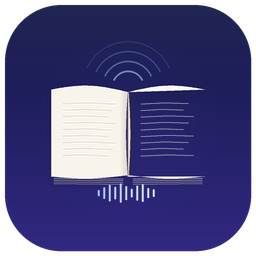

# BookVoice

<p align="center">
  
</p>

<p align="center">
  <b>macOS-приложение для создания аудиокниг из текста</b><br>
  Синтез речи, клонирование голоса, конвертация тембра — всё в одном
</p>

<p align="center">
  
  
  
  
</p>

---

## Что это такое

BookVoice — нативное macOS-приложение, которое превращает текст в аудиокнигу за пять шагов. Поддерживает шесть провайдеров синтеза речи (три локальных, три облачных), изменение тембра голоса через RVC и экспорт с метаданными в четырёх форматах.

Весь локальный синтез работает на вашем Mac — без отправки текста на внешние серверы.

## Возможности

- **6 TTS-провайдеров** — Silero, Kokoro, Qwen3 (локально и облачно), ElevenLabs, любой свой API
- **Клонирование голоса** — модели Qwen3 Base копируют тембр по образцу аудио
- **Дизайн голоса** — опишите голос текстом, и Qwen3 VoiceDesign создаст его
- **Конвертация тембра** — RVC заменяет голос на другой после синтеза
- **Гибкая сегментация** — по предложениям, абзацам, главам или фиксированными блоками
- **Экспорт** — MP3, M4A, WAV, FLAC с обложкой и метаданными (название, автор, альбом)
- **Библиотека голосов** — сохраняйте и переиспользуйте профили голосов
- **Автоматическая настройка** — приложение само создаёт Python-окружение и ставит зависимости

## Системные требования

| Компонент | Требование |
|-----------|------------|
| ОС | macOS 14 Sonoma или новее |
| Xcode | 15+ (для сборки из исходников) |
| Python | 3.11 / 3.12 / 3.13 (рекомендуется через Homebrew) |
| RAM | 8 ГБ минимум, 16+ ГБ для крупных моделей Qwen3 |
| Диск | ~5 ГБ для моделей (скачиваются при первом запуске) |
| SoX | Требуется для Qwen3 TTS (`brew install sox`) |

## Быстрый старт

### 1. Установите Python и SoX

```bash
brew install python@3.12 sox
```

### 2. Соберите и запустите

```bash
git clone <repo-url>
cd BookVoice
open BookVoice.xcodeproj
# Cmd+R в Xcode
```

### 3. Создайте аудиокнигу

Откройте приложение и следуйте мастеру из пяти шагов:

1. **Настройка модели** — выберите провайдер, приложение само настроит Python-окружение
2. **Загрузка текста** — откройте .txt или .epub, выберите способ разбиения
3. **Озвучка** — выберите модель и голос, нажмите «Озвучить всё»
4. **Изменение тембра** — (опционально) замените голос через RVC-модель
5. **Экспорт** — задайте формат, метаданные и сохраните аудиокнигу

## TTS-провайдеры

| Провайдер | Тип | Языки | Особенности |
|-----------|-----|-------|-------------|
| **Silero** | Локальный | RU, EN, DE, FR | Быстрый, 48 кГц, несколько голосов на язык |
| **Kokoro** | Локальный | Мультиязычный | Естественное звучание, лёгкий |
| **Qwen3 Local** | Локальный | Мультиязычный | 5 моделей: клонирование, дизайн, 9 голосов |
| **Qwen3 Cloud** | Облачный | Мультиязычный | DashScope API, нужен API-ключ |
| **ElevenLabs** | Облачный | Мультиязычный | Профессиональные голоса, нужен API-ключ |
| **Custom API** | Любой | — | Свой эндпоинт HTTP |

### Модели Qwen3 TTS

| Модель | Размер | Что умеет |
|--------|--------|-----------|
| `0.6B-Base` | 0.6B | Клонирование голоса по образцу аудио |
| `1.7B-Base` | 1.7B | Клонирование голоса (качественнее) |
| `0.6B-CustomVoice` | 0.6B | 9 встроенных голосов + инструкции |
| `1.7B-CustomVoice` | 1.7B | 9 встроенных голосов + инструкции (качественнее) |
| `1.7B-VoiceDesign` | 1.7B | Создание голоса по текстовому описанию |

## Структура проекта

```
BookVoice/
├── BookVoiceApp.swift              # Точка входа, SwiftData-контейнер
├── Models/                         # Модели данных (SwiftData)
│   ├── VoiceoverProject.swift      # Главная модель — проект озвучки
│   ├── VoiceProfile.swift          # Профиль голоса для библиотеки
│   ├── TextSegment.swift           # Сегмент текста
│   ├── AudioSegment.swift          # Аудиофрагмент
│   └── Enums/                      # TTSProvider, AudioFormat, и т.д.
├── ViewModels/                     # MVVM — ViewModel-слой
│   ├── WizardViewModel.swift       # Оркестратор 5-шагового мастера
│   ├── ModelSettingsViewModel.swift # Шаг 1
│   ├── TextUploadViewModel.swift   # Шаг 2
│   ├── VoiceoverViewModel.swift    # Шаг 3
│   ├── TimbreChangeViewModel.swift # Шаг 4
│   └── PostProcessingViewModel.swift # Шаг 5
├── Views/                          # SwiftUI-экраны
│   ├── Wizard/                     # 5 шагов мастера
│   ├── VoiceLibrary/               # Библиотека голосов
│   ├── History/                    # История проектов
│   ├── Settings/                   # Настройки
│   └── Components/                 # Переиспользуемые компоненты
├── Services/                       # Бизнес-логика
│   ├── Protocols/                  # Интерфейсы сервисов
│   ├── Live/                       # Рабочие реализации
│   │   ├── LiveTTSService.swift    # Маршрутизация TTS-запросов
│   │   ├── LocalServerManager.swift# Python venv + FastAPI-серверы
│   │   └── ...
│   └── Mock/                       # Заглушки для превью
├── Utilities/                      # Вспомогательные модули
│   └── AppConstants.swift          # Пути, порты, значения по умолчанию
└── Resources/Scripts/              # Python-серверы
    ├── tts_server.py               # FastAPI TTS-сервер
    ├── rvc_server.py               # FastAPI RVC-сервер
    └── requirements_*.txt          # Зависимости по провайдерам
```

## Архитектура

Подробная документация по архитектуре, Python-серверам и каждому шагу мастера — в папке [doc/](doc/).

- [Архитектура приложения](doc/architecture.md)
- [Python-серверы](doc/python-servers.md)
- [Мастер озвучки (5 шагов)](doc/wizard.md)
- [TTS-провайдеры](doc/tts-providers.md)

## Лицензия

Проект находится в стадии активной разработки.
